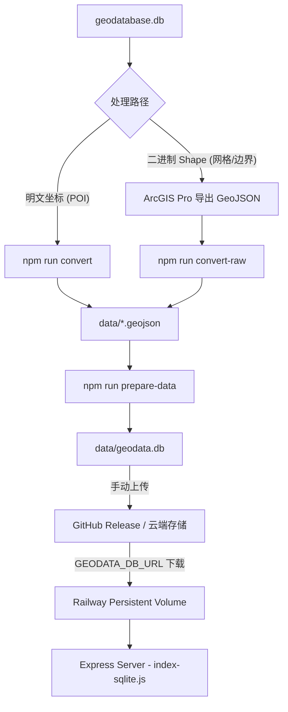

# 数据管线与更新指南 (Data Pipeline & Update SOP)

> 本文档详细记录了 `nature-geo-vis` 项目的数据处理流程、存储架构以及如何更新数据并同步到云端。

---

## 1. 核心架构总览

项目采用 **“本地预处理 -> 云端冷启动”** 的数据同步模型，以应对地理数据（GeoJSON/SQLite）过大无法直接存入 GitHub 仓库的问题。

### 数据流向图


---

## 2. 为什么数据是分两路处理的？

在原始的 `geodatabase.db` 中，不同表的存储结构不同：

| 图层 / 表名 | 坐标存储方式 | 脚本解析能力 | 更新策略 |
| :--- | :--- | :--- | :--- |
| **POI 学校** (`China_city_POI_JS2020`) | **明文字段** `wgs84lon` / `lat` | ✅ 完全自动提取 | `npm run convert` |
| **网格数据** (`China_city_cell`) | **二进制 Shape Blob** | ❌ 外部导出更稳 | ArcGIS Pro 导出 + `convert-raw` |
| **行政区/边界** (`China_city_pg` / `pl`) | **二进制 Shape Blob** | ❌ 外部导出更稳 | ArcGIS Pro 导出 + `convert-raw` |

**结论**：由于开源库解析 ESRI 私有二进制格式不完善，面/线状数据必须先在 ArcGIS Pro 中导出为标准 GeoJSON 格式后，再进入项目的 Node 处理管线。

---

## 3. 下次更新数据的操作流程

### 第一步：本地数据转换
1.  **准备原始文件**：将最新库覆盖到根目录 `geodatabase.db`（该文件 gitignore，不提交）。
2.  **从 geodatabase 更新属性/POI（推荐）**：
    ```bash
    npm run update-from-nc   # 合并网格/城市属性，导出 JS+PS POI
    npm run import-data      # 重建 data/geodata.db
    ```
    表字段映射见 `docs/NC_DATA_MAPPING.md`。
3.  **旧流程（全量重导几何）**：若需重做面/线几何，仍用 ArcGIS 导出 → `convert-raw` → `prepare-data`。

### 第二步：发布与云端同步 (关键)
由于 `.gitignore` 忽略了超过 100MB 的 `data/geodata.db`，**直接 Git Push 是无效的**。

1.  **手动发布**：将本地生成的 `data/geodata.db` (约 760MB) 上传到 **GitHub Release** 或其他持久化云存储。
> 如：https://github.com/HITNature/nature-geo-vis/releases/tag/v1.0.0-data
2.  **更新环境变量**：在 Railway 控制面板中，将环境变量 `GEODATA_DB_URL` 更新为新的下载直连。
3.  **重启服务**：手动点击 Railway 的 `Deploy` 或 `Redeploy`。
    -   服务启动时将执行 `scripts/ensure-db.js`。
    -   脚本会根据 URL 下载数据库并存入 `data/` 目录。

---

## 4. 自动化脚本说明

| 脚本 | 功能 |
| :--- | :--- |
| `scripts/convert-geodata.js` | 从 Geodatabase 提取 POI 明文坐标。 |
| `scripts/convert-raw-data.js` | 统一所有 GeoJSON 为 WGS84 坐标系。 |
| `scripts/split-geojson.js` | 顺序分片大文件（规避 GitHub 限制，辅助备份）。 |
| `scripts/import-to-sqlite.js` | **核心**：建立带空间索引的终极数据库。 |
| `scripts/ensure-db.js / .sh` | **Railway 专属**：确保部署环境的数据库文件存在。 |

---

## 5. 注意事项 (QA)

-   **Q: 为什么数据更新后，地图边界和悬停标签（Tooltip）对不上？（如：悬停在黑龙江绥化却显示辽宁丹东）**
    -   **A**: 这是因为新旧地理数据库的 `OBJECTID` 发生了漂移错位。在运行数据属性合并脚本时，**千万不能使用 OBJECTID 匹配**。`scripts/update-from-nc.js` 已被修改为**统一使用唯一的“城市名称 / POI 名称”进行对齐匹配**。在未来更新数据时，请务必保持这一原则。
-   **Q: 为什么本地修改了后端代码（如新增 API），前端请求却一直报 404？**
    -   **A**: 前端（Vite）具有热重载（HMR）功能，修改前端代码会自动刷新页面；但后端 Node.js/Express 服务默认没有热重载。如果修改了后端接口，**需要手动在控制台重启后端服务**（或者重新运行 `npm run web`）以注册新路由。
-   **Q: 为什么 Railway 部署后，后端服务启动直接 Crash，报错类似 `no such column: p.poi_type`？**
    -   **A**: 这是由于 **“后端代码升级与云端数据库 Schema 不匹配”** 导致的。
        - **起因**：我们在后端代码中新增了字段查询（如 `p.poi_type`），但 Railway 启动时，自动从 GitHub Release（如 `v1.0.0-data`）下载的依然是**未更新的旧版数据库**。新代码查询旧数据库，找不到新增列，导致服务直接崩溃。
        - **解决方案**：
          1. 本地运行 `npm run update-from-nc` 和 `npm run import-data` 生成最新的、带有新字段的 `data/geodata.db`。
          2. 使用 GitHub CLI 或网页端，将最新的 `geodata.db` **重新上传覆盖（Clobber）** 到当前的 GitHub Release（`v1.0.0-data`）中。
          3. 在 Railway 控制面板中，确保环境变量 `FORCE_DB_DOWNLOAD=true`，然后点击 **Redeploy**（重新部署）或 **Restart**（重启）。容器启动时会强制删除旧库并拉取最新的正确数据库，服务即可完美复活。
-   **Q: 为什么 Railway 上运行不起来？**
    -   检查 `GEODATA_DB_URL` 链接是否有效，或者是否忘记挂载持久化 Volume。没有 Volume 的话，重启可能导致数据库文件丢失需要重下。
-   **Q: 字段名变了怎么办？**
    -   如果数据库表字段命名变更，请同步修改 `scripts/convert-geodata.js` 中的 SQL 语句和 `server/index-sqlite.js` 中的查询语句。
-   **Q: 本地开发需要每次都跑全流程吗？**
    -   不需要。如果只是修改了前端 UI，只要 `data/geodata.db` 还在，直接 `npm run dev` 即可。
