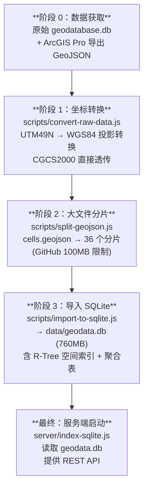

# 数据管线文档：从源数据到可视化

> 本文档梳理了 nature-geo-vis 项目的完整数据流转路径，包括数据来源、处理脚本、切片逻辑与数据库生成过程，以及未来更新数据的操作指南。

---

## 1. 数据总览

项目的地理可视化数据共涉及 **4 个图层**，全部来源于同一个 ArcGIS Geodatabase 文件：

| 图层 | 原始表名 | 数据类型 | 记录数 | 说明 |
|------|----------|----------|--------|------|
| 国境线 | `China_city_pl` | LineString | 7 | 中国国境边界线 |
| 行政区划 | `China_city_pg` | Polygon | 355 | 中国城市行政区划 |
| 网格 | `China_city_cell` | Polygon | 177,610 | 城市区域 1km 网格分割 |
| POI | `China_city_POI_JS2020` | Point | 32,231 | 2020年城市初中 POI 点 |

---

## 2. 数据来源与格式

### 2.1 最原始文件

项目根目录下的 [geodatabase.db](file:///Users/xyliu3/Desktop/work/nature-geo-vis/geodatabase.db)（127MB）是数据提供者给出的 ArcGIS Pro `.geodatabase` 文件。

> [!IMPORTANT]
> 这个文件本质上是一个 **SQLite 数据库**，可以通过 `better-sqlite3` 直接读取。被手动改名为 [.db](file:///Users/xyliu3/Desktop/work/nature-geo-vis/geodatabase.db) 后缀以便程序读取。

### 2.2 导出的中间 GeoJSON 文件

由于直接从 geodatabase 的二进制 Shape blob 解析的脚本（[convert-geodata.js](file:///Users/xyliu3/Desktop/work/nature-geo-vis/scripts/convert-geodata.js)）**对复杂几何体支持不完善**，后来改为由**数据提供者使用 ArcGIS Pro** 导出 GeoJSON，放入 [raw-data/](file:///Users/xyliu3/Desktop/work/nature-geo-vis/raw-data) 目录：

| 原始导出文件 | 坐标系 | 大小 | 目标文件 |
|-------------|--------|------|----------|
| [raw-data/china_pl.geojson](file:///Users/xyliu3/Desktop/work/nature-geo-vis/raw-data/china_pl.geojson) | EPSG:4490 (CGCS2000) | 48KB | [data/boundaries.geojson](file:///Users/xyliu3/Desktop/work/nature-geo-vis/data/boundaries.geojson) |
| [raw-data/china_pg.geojson](file:///Users/xyliu3/Desktop/work/nature-geo-vis/raw-data/china_pg.geojson) | EPSG:4490 (CGCS2000) | 8MB | [data/cities.geojson](file:///Users/xyliu3/Desktop/work/nature-geo-vis/data/cities.geojson) |
| [raw-data/china_cell.geojson](file:///Users/xyliu3/Desktop/work/nature-geo-vis/raw-data/china_cell.geojson) | EPSG:32649 (UTM 49N) | 424MB | `data/cells.geojson` |
| POI 数据 | 无需导出 | — | 从 [geodatabase.db](file:///Users/xyliu3/Desktop/work/nature-geo-vis/geodatabase.db) 直接转 |

> [!NOTE]
> POI 数据（`China_city_POI_JS2020`）表中已有 `wgs84lon` / `wgs84lat` 字段，可以由脚本 [convert-geodata.js](file:///Users/xyliu3/Desktop/work/nature-geo-vis/scripts/convert-geodata.js) 直接读取 SQLite 生成，不需要 ArcGIS 导出。

---

## 3. 完整数据处理管线

数据从原始状态到最终服务端使用，经历以下 **4 个阶段**：



### 3.1 阶段 0：数据获取

有两条路径获取数据：

**路径 A：ArcGIS Pro 导出（boundaries / cities / cells）**

需要在安装了 ArcGIS Pro 的电脑上运行 [export_arcpy.py](file:///Users/xyliu3/Desktop/work/nature-geo-vis/scripts/export_arcpy.py)，或手动在 ArcGIS Pro 中导出：

```
ArcGIS Pro → Features To JSON → GeoJSON 格式
  China_city_pl   → raw-data/china_pl.geojson
  China_city_pg   → raw-data/china_pg.geojson
  China_city_cell → raw-data/china_cell.geojson
```

**路径 B：直接从 geodatabase.db 读取（POI）**

POI 数据可通过 `npm run convert` 从 [geodatabase.db](file:///Users/xyliu3/Desktop/work/nature-geo-vis/geodatabase.db) 直接提取，因为表中自带 `wgs84lon` / `wgs84lat` 经纬度字段。

### 3.2 阶段 1：坐标转换（`npm run convert-raw`）

**对应脚本**: [convert-raw-data.js](file:///Users/xyliu3/Desktop/work/nature-geo-vis/scripts/convert-raw-data.js)

**功能**：将 `raw-data/` 下的 GeoJSON 文件坐标统一转换为 **WGS84 (EPSG:4326)**，输出到 `data/` 目录。

| 输入 | 源坐标系 | 处理方式 | 输出 |
|------|----------|----------|------|
| [china_pl.geojson](file:///Users/xyliu3/Desktop/work/nature-geo-vis/raw-data/china_pl.geojson) | CGCS2000 | 直接复制（与 WGS84 几乎一致） | [boundaries.geojson](file:///Users/xyliu3/Desktop/work/nature-geo-vis/data/boundaries.geojson) |
| [china_pg.geojson](file:///Users/xyliu3/Desktop/work/nature-geo-vis/raw-data/china_pg.geojson) | CGCS2000 | 直接复制 | [cities.geojson](file:///Users/xyliu3/Desktop/work/nature-geo-vis/data/cities.geojson) |
| [china_cell.geojson](file:///Users/xyliu3/Desktop/work/nature-geo-vis/raw-data/china_cell.geojson) | UTM 49N | **proj4 投影转换** | `cells.geojson` |

> [!TIP]
> CGCS2000 (EPSG:4490) 与 WGS84 (EPSG:4326) 的差异在厘米级，实际应用中可直接透传，脚本中也是如此处理的。

### 3.3 阶段 2：大文件分片（`npm run split-data`）

**对应脚本**: [split-geojson.js](file:///Users/xyliu3/Desktop/work/nature-geo-vis/scripts/split-geojson.js)

**为什么需要分片**：
- `cells.geojson` 约 420MB，超过 GitHub 100MB 文件大小限制
- 同时也便于内存有限时分批加载

**分片逻辑**：

```
阈值：文件 > 50MB 才分片
每片：5,000 个 Feature
cells.geojson (177,610 features) → cells_chunks/
  ├── _index.json          (索引元数据)
  ├── cells_001.geojson    (features 0-4999)
  ├── cells_002.geojson    (features 5000-9999)
  ├── ...
  └── cells_036.geojson    (features 175000-177609)
```

分片后，原始 `cells.geojson` 被自动重命名为 [cells.geojson.backup](file:///Users/xyliu3/Desktop/work/nature-geo-vis/data/cells.geojson.backup)。

> [!NOTE]
> 分片是**纯顺序切割**，按 Feature 在 GeoJSON 文件中的原始顺序，每 5000 个切一份。没有按地理区域分片。

### 3.4 阶段 3：导入 SQLite（`npm run import-data`）

**对应脚本**: [import-to-sqlite.js](file:///Users/xyliu3/Desktop/work/nature-geo-vis/scripts/import-to-sqlite.js)

**功能**：将所有 GeoJSON 数据导入 [data/geodata.db](file:///Users/xyliu3/Desktop/work/nature-geo-vis/data/geodata.db) SQLite 数据库，并创建空间索引和聚合表。

**导入优先级**：脚本会优先从分片目录（`*_chunks/`）加载，其次尝试单个 [.geojson](file:///Users/xyliu3/Desktop/work/nature-geo-vis/data/pois.geojson) 文件，再其次尝试 [.geojson.backup](file:///Users/xyliu3/Desktop/work/nature-geo-vis/data/cells.geojson.backup) 文件。

**产出的数据库结构**：

| 表名 | 内容 | 空间索引 |
|------|------|----------|
| `boundaries` | 国境线（geometry + properties JSON） | 无（数据量小） |
| `cities` | 行政区划（含 bbox 列） | `cities_rtree` (R-Tree) |
| `cells` | 网格数据（含 bbox 列 + 核心属性列） | `cells_rtree` (R-Tree) |
| `pois` | POI 点位（含 lng/lat 列） | `pois_rtree` (R-Tree) |
| `pois_aggregated_province` | 省级 POI 聚合 | — |
| `pois_aggregated_city` | 市级 POI 聚合 | — |
| `pois_aggregated_district` | 区县级 POI 聚合 | — |

> [!IMPORTANT]
> [geodata.db](file:///Users/xyliu3/Desktop/work/nature-geo-vis/data/geodata.db)（约 760MB）是服务端 [index-sqlite.js](file:///Users/xyliu3/Desktop/work/nature-geo-vis/server/index-sqlite.js) 唯一依赖的数据文件。生产部署时需要确保此文件存在。

### 3.5 服务端启动

**当前主力服务端**：[server/index-sqlite.js](file:///Users/xyliu3/Desktop/work/nature-geo-vis/server/index-sqlite.js)（`npm run server`）

直接从 [data/geodata.db](file:///Users/xyliu3/Desktop/work/nature-geo-vis/data/geodata.db) 读取数据，通过 R-Tree 空间索引实现高效的视口查询。

> 还有一个遗留服务端 [server/index.js](file:///Users/xyliu3/Desktop/work/nature-geo-vis/server/index.js)（`npm run server:legacy`），它直接从 GeoJSON 文件全量加载到内存，已不推荐使用。

---

## 4. 当前自动化程度

### ✅ 已自动化的步骤（npm scripts）

| 命令 | 对应脚本 | 功能 |
|------|----------|------|
| `npm run convert` | [scripts/convert-geodata.js](file:///Users/xyliu3/Desktop/work/nature-geo-vis/scripts/convert-geodata.js) | 从 geodatabase.db 提取 POI 数据 |
| `npm run convert-raw` | [scripts/convert-raw-data.js](file:///Users/xyliu3/Desktop/work/nature-geo-vis/scripts/convert-raw-data.js) | 坐标转换 raw-data → data |
| `npm run split-data` | [scripts/split-geojson.js](file:///Users/xyliu3/Desktop/work/nature-geo-vis/scripts/split-geojson.js) | 大文件分片 |
| `npm run import-data` | [scripts/import-to-sqlite.js](file:///Users/xyliu3/Desktop/work/nature-geo-vis/scripts/import-to-sqlite.js) | 导入 SQLite + 建索引 |
| `npm run prepare-data` | 组合命令 | = split-data + import-data |

### ❌ 未自动化的步骤

| 步骤 | 原因 | 解决方式 |
|------|------|----------|
| ArcGIS Pro 导出 GeoJSON | 需要 ArcGIS Pro 软件和 arcpy 环境 | 手动导出或使用 [export_arcpy.py](file:///Users/xyliu3/Desktop/work/nature-geo-vis/scripts/export_arcpy.py) |
| 将新的 GeoJSON 放入 `raw-data/` | 手动操作 | 手动复制 |

---

## 5. 数据更新操作指南

> [!IMPORTANT]
> 以下是完整的数据更新流程，请按顺序执行。

### 场景 1：更新全部 4 个图层

适用于数据提供者重新给了一套完整的新数据。

```bash
# -------- 前置条件 --------
# 1. 将新的 geodatabase 文件放到项目根目录，命名为 geodatabase.db
# 2. 在装有 ArcGIS Pro 的电脑上导出 3 个 GeoJSON 文件
#    （使用 scripts/export_arcpy.py 或手动导出）
#    导出结果：
#      China_city_pl   → china_pl.geojson
#      China_city_pg   → china_pg.geojson 
#      China_city_cell → china_cell.geojson
# 3. 将上述 3 个文件放入 raw-data/ 目录

# -------- 自动化处理 --------

# 步骤 1: 从 geodatabase.db 提取 POI 数据到 data/pois.geojson
npm run convert

# 步骤 2: 坐标转换 (raw-data → data)
#   china_pl.geojson  → boundaries.geojson (CGCS2000→WGS84 直通)
#   china_pg.geojson  → cities.geojson     (CGCS2000→WGS84 直通)
#   china_cell.geojson → cells.geojson     (UTM49N→WGS84 投影转换)
npm run convert-raw

# 步骤 3: 分片 + 导入 SQLite
#   cells.geojson 分成 36 个分片 (每片 5000 features)
#   所有 GeoJSON 导入 data/geodata.db 并建立 R-Tree 索引
npm run prepare-data

# -------- 验证 --------
# 启动服务确认数据正常
npm run web
```

### 场景 2：只更新 POI 数据

如果只是 POI 数据有变化，且新数据仍在 [geodatabase.db](file:///Users/xyliu3/Desktop/work/nature-geo-vis/geodatabase.db) 中：

```bash
# 1. 替换 geodatabase.db
# 2. 重新提取 POI
npm run convert

# 3. 重新导入 SQLite（会重建整个库！）
npm run import-data
```

### 场景 3：只更新网格数据

```bash
# 1. 在 ArcGIS Pro 中导出新的 china_cell.geojson 到 raw-data/
# 2. 坐标转换
npm run convert-raw
# 3. 分片 + 导入
npm run prepare-data
```

### 场景 4：数据字段变化

如果新数据的**字段名称发生了变化**，需要同步修改以下文件：

| 文件 | 需要修改的内容 |
|------|---------------|
| [scripts/convert-geodata.js](file:///Users/xyliu3/Desktop/work/nature-geo-vis/scripts/convert-geodata.js) | [convertPOIs()](file:///Users/xyliu3/Desktop/work/nature-geo-vis/scripts/convert-geodata.js#192-236) 和 [convertCells()](file:///Users/xyliu3/Desktop/work/nature-geo-vis/scripts/convert-geodata.js#140-191) 中的 SQL 查询语句和字段映射 |
| [scripts/convert-raw-data.js](file:///Users/xyliu3/Desktop/work/nature-geo-vis/scripts/convert-raw-data.js) | 通常无需修改（它不过滤字段） |
| [scripts/import-to-sqlite.js](file:///Users/xyliu3/Desktop/work/nature-geo-vis/scripts/import-to-sqlite.js) | [importCells()](file:///Users/xyliu3/Desktop/work/nature-geo-vis/scripts/import-to-sqlite.js#192-295) 和 [importPOIs()](file:///Users/xyliu3/Desktop/work/nature-geo-vis/scripts/import-to-sqlite.js#296-371) 中的表结构（CREATE TABLE）和 INSERT 语句 |
| [server/index-sqlite.js](file:///Users/xyliu3/Desktop/work/nature-geo-vis/server/index-sqlite.js) | SQL 查询语句和返回的字段映射 |
| [server/config.js](file:///Users/xyliu3/Desktop/work/nature-geo-vis/server/config.js) | `displayFields` 和 `poiDisplayFields` 的 key/label |
| 前端组件 | `MapView.jsx` / `DetailPanel.jsx` 中的字段引用 |

---

## 6. 文件关系与数据流全图

```
                    ┌─────────────────────────┐
                    │  ArcGIS geodatabase      │
                    │  (paper_data.geodatabase) │
                    │  → 重命名为 geodatabase.db │
                    └──────────┬──────────────┘
                               │
              ┌────────────────┼────────────────┐
              │                │                │
              ▼                │                ▼
    ┌─────────────────┐        │    ┌──────────────────────┐
    │ ArcGIS Pro 导出  │        │    │ convert-geodata.js   │
    │ (手动/arcpy)     │        │    │ (npm run convert)    │
    │                 │        │    │ 直接读 SQLite 中的    │
    │ 导出 3 个 GeoJSON │        │    │ POI 表的 lon/lat     │
    └────────┬────────┘        │    └──────────┬───────────┘
             │                 │               │
             ▼                 │               ▼
    ┌─────────────────┐        │    ┌──────────────────────┐
    │ raw-data/       │        │    │ data/pois.geojson    │
    │  china_pl.geojson│       │    │ (10MB, 32,231 POIs)  │
    │  china_pg.geojson│       │    └──────────┬───────────┘
    │  china_cell.geojson      │               │
    └────────┬────────┘        │               │
             │                 │               │
             ▼                 │               │
    ┌─────────────────┐        │               │
    │ convert-raw-data │        │               │
    │ (npm run convert-raw)    │               │
    │ UTM→WGS84 + 透传  │       │               │
    └────────┬────────┘        │               │
             │                 │               │
             ▼                 │               │
    ┌─────────────────┐        │               │
    │ data/           │        │               │
    │  boundaries.geojson (33KB)               │
    │  cities.geojson (8MB)    │               │
    │  cells.geojson (420MB)   │               │
    └────────┬────────┘        │               │
             │                 │               │
             ▼                 │               │
    ┌─────────────────┐        │               │
    │ split-geojson.js │        │               │
    │ (npm run split-data)     │               │
    │ cells > 50MB → 分片      │               │
    └────────┬────────┘        │               │
             │                 │               │
             ▼                 │               │
    ┌─────────────────┐        │               │
    │ data/cells_chunks/       │               │
    │  _index.json    │        │               │
    │  cells_001-036.geojson   │               │
    └────────┬────────┘        │               │
             │                 │               │
             ├─────────────────┴───────────────┘
             │
             ▼
    ┌─────────────────────────┐
    │ import-to-sqlite.js     │
    │ (npm run import-data)   │
    │                         │
    │ 读取所有 data/*.geojson │
    │ + cells_chunks/         │
    │ → data/geodata.db (760MB)│
    │ + R-Tree 空间索引       │
    │ + 省/市/区聚合表        │
    └────────┬────────────────┘
             │
             ▼
    ┌─────────────────────────┐
    │ server/index-sqlite.js  │
    │ (npm run server)        │
    │                         │
    │ 读取 geodata.db         │
    │ 提供 REST API           │
    │ 前端 ← 视口查询 → 渲染  │
    └─────────────────────────┘
```

---

## 7. 关键注意事项

> [!WARNING]
> **[import-to-sqlite.js](file:///Users/xyliu3/Desktop/work/nature-geo-vis/scripts/import-to-sqlite.js) 会删除并重建整个数据库！**
> 每次运行 `npm run import-data` 都会先删除已有的 [data/geodata.db](file:///Users/xyliu3/Desktop/work/nature-geo-vis/data/geodata.db)，然后从零重建。如果只想增量更新某个图层，目前没有支持，需要修改脚本或手动操作 SQLite。

> [!CAUTION]
> **大文件注意事项**
> - `cells.geojson` (~420MB) 和 [geodata.db](file:///Users/xyliu3/Desktop/work/nature-geo-vis/data/geodata.db) (~760MB) 都在 [.gitignore](file:///Users/xyliu3/Desktop/work/nature-geo-vis/.gitignore) 中，**不会被 Git 跟踪**
> - 部署时 [geodata.db](file:///Users/xyliu3/Desktop/work/nature-geo-vis/data/geodata.db) 通过环境变量 `GEODATA_DB_URL` 远程下载（见 [ensure-db.js](file:///Users/xyliu3/Desktop/work/nature-geo-vis/scripts/ensure-db.js)）
> - 本地开发时需确保 [data/geodata.db](file:///Users/xyliu3/Desktop/work/nature-geo-vis/data/geodata.db) 文件存在

> [!TIP]
> **一键更新命令速查**（在已准备好原始数据的前提下）：
> ```bash
> npm run convert && npm run convert-raw && npm run prepare-data
> ```

---

## 8. 未来改进建议

1. **编写统一的数据更新脚本** — 可以新增一个 `npm run update-all` 命令，串联所有步骤
2. **增量导入** — 修改 [import-to-sqlite.js](file:///Users/xyliu3/Desktop/work/nature-geo-vis/scripts/import-to-sqlite.js) 支持只更新某个表而不是重建整个库
3. **去 ArcGIS 依赖** — 考虑使用 GDAL (`ogr2ogr`) 或 Python `geopandas` 替代 ArcGIS Pro 导出步骤，使整个管线可以在无 ArcGIS 环境下运行：
   ```bash
   # 使用 ogr2ogr 替代方案
   ogr2ogr -f "GeoJSON" raw-data/china_cell.geojson geodatabase.db China_city_cell
   ```
4. **CI/CD 自动化** — 在数据更新后自动触发 `prepare-data`  + 部署
