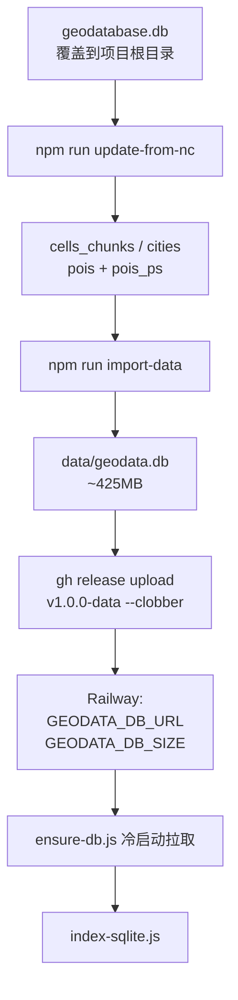

# 数据更新与上云文档

> 日常「换库 → 重建运行库 → 同步 Railway」操作手册。
>
> - **管线原理 / 表结构 / 遗留几何路径** → [`数据管线文档.md`](./数据管线文档.md)
> - **NC 字段映射** → [`表字段映射.md`](./表字段映射.md)

---

## 1. 架构一览

采用 **本地清洗 → GitHub Release 托管 → Railway Volume 挂载**：



当前运行库规模（本地实测）：POI **78,444**（JS 32,231 + PS 46,213）、网格 **177,610**、城市 355、国境线 7。

---

## 2. 为什么几何与属性分路？

| 图层 | 源表 | 坐标形态 | 日常策略 |
|------|------|----------|----------|
| 网格 | `GCs_level` | Shape blob | 复用 `cells_chunks` 几何，刷属性 |
| 行政区 | `city_level` | Shape blob | 复用 `cities.geojson` 几何，按**城市名**刷属性 |
| 初中 / 小学 POI | `JS_POI_level` / `PS_POI_level` | 明文 lon/lat | 直接导出 GeoJSON |
| 国境线 | （新库通常无表） | — | 沿用现有 `boundaries.geojson` |

面/线几何首次入库仍需 ArcGIS 导出，见管线文档 §3.2。日常换数**不必**再走 ArcGIS。

---

## 3. 本地更新（推荐）

```bash
# 1. 用最新 .geodatabase 覆盖根目录 geodatabase.db（勿提交）

# 2. 清洗属性 + 导出 JS/PS POI
npm run update-from-nc

# 3. 重建运行库（会删除并重建 data/geodata.db）
npm run import-data

# 4. 本地验证
npm run web
```

### 何时才需要旧的「全量重导几何」？

仅当网格/城市**边界本身**变了（分片几何失效）时：

```bash
# ArcGIS 导出 → raw-data/ →
npm run convert-raw
npm run prepare-data          # split + import
# 建议随后再跑一遍 update-from-nc && import-data，对齐最新 NC 属性
```

**不要**再对当前源库执行 `npm run convert`：它仍查询已删除的旧表 `China_city_POI_JS2020`。

---

## 4. 发布到云端（必做）

`data/geodata.db` 被 gitignore，**push 代码不会更新数据**。

1. **上传 Release**（覆盖同标签资源）：

   ```bash
   gh release upload v1.0.0-data data/geodata.db --clobber
   ```

   参考：https://github.com/HITNature/nature-geo-vis/releases/tag/v1.0.0-data

2. **对齐字节数**（触发 Volume 内旧库失效重下）：

   ```bash
   # macOS
   stat -f %z data/geodata.db
   # Linux
   stat -c %s data/geodata.db
   ```

   将输出整数写入 Railway 环境变量 **`GEODATA_DB_SIZE`**。

3. 确认 **`GEODATA_DB_URL`** 指向该 Release 资源直链。

4. **Redeploy** Railway。启动时 `scripts/ensure-db.js` 若发现本地库大小与 `GEODATA_DB_SIZE` 不符，会删旧库并重新下载。

---

## 5. 脚本一览

| 脚本 | 用途 |
|------|------|
| `scripts/update-from-nc.js` | **日常主力**：NC 库 → 更新分片/城市属性 + 导出 POI |
| `scripts/import-to-sqlite.js` | **核心**：重建带 R-Tree / 聚合表的 `geodata.db` |
| `scripts/ensure-db.js` | Railway 冷启动拉取运行库 |
| `scripts/convert-raw-data.js` | 几何重建：`raw-data` → WGS84 |
| `scripts/split-geojson.js` | 几何重建：cells 分片 |
| `scripts/convert-geodata.js` | ⚠️ 遗留（旧表名），勿用于当前 NC 库 |
| `scripts/export_arcpy.py` | 几何重建时的 ArcGIS 导出辅助 |

---

## 6. 常见问题

**Q: 悬停城市标签错位（绥化显示成丹东）？**  
A: OBJECTID 漂移。城市与初中 POI 行政字段必须用**名称**对齐，见 `update-from-nc.js` 与 AGENTS.md §1.2。网格挂几何仍用 OBJECTID，但省份会用 `city_level` 城市名映射纠偏。

**Q: 改了后端 API，前端一直 404？**  
A: Express 无 HMR，需重启后端或重跑 `npm run web`。

**Q: Railway Crash：`no such column: p.poi_type`？**  
A: 代码已升、Volume 里仍是旧库。按 §4 重新 `update-from-nc` → `import-data` → Release `--clobber` → 更新 `GEODATA_DB_SIZE` → Redeploy。

**Q: Railway 起不来 / 每次重启都重下库？**  
A: 检查 `GEODATA_DB_URL` 是否可访问，以及是否挂载了 Persistent Volume。

**Q: 字段名变了改哪里？**  
A: `update-from-nc.js` → `import-to-sqlite.js` → `server/index-sqlite.js` → `server/config.js` → 前端详情/图例。映射表见 [`表字段映射.md`](./表字段映射.md)。

**Q: 只改前端要不要重跑管线？**  
A: 不用。本地已有 `data/geodata.db` 时直接 `npm run web` / `npm run dev` 即可。
