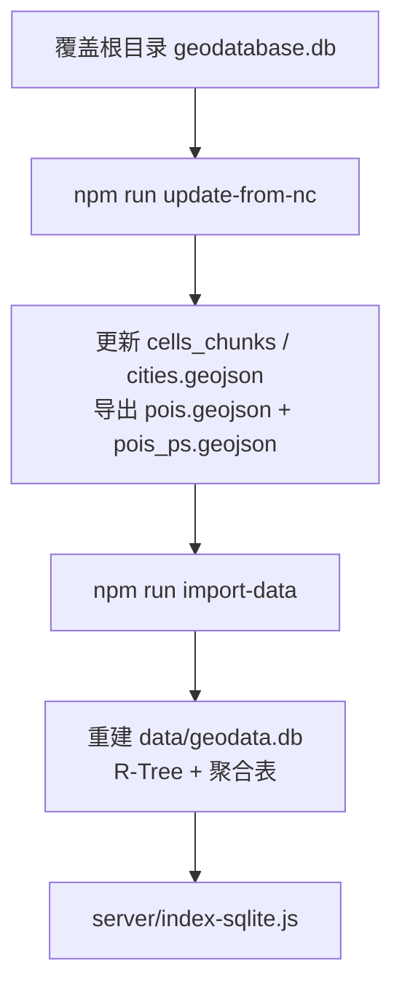
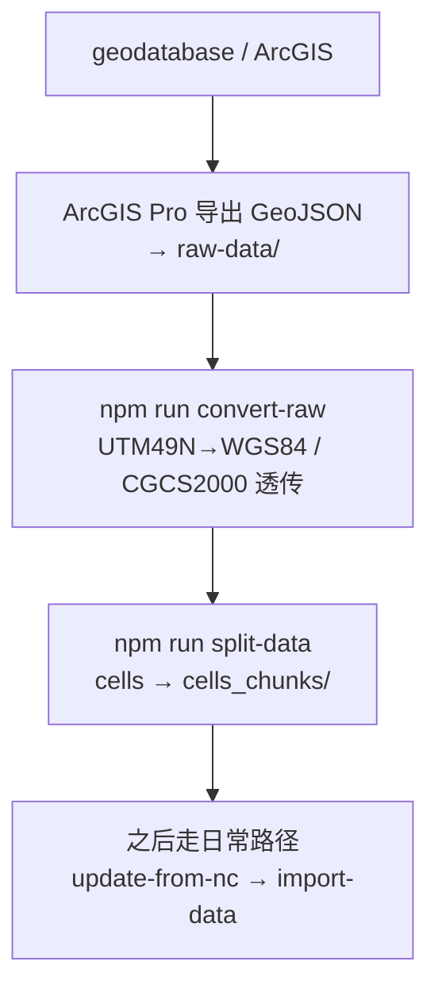

# 数据管线文档：从源数据到可视化

> 梳理 `nature-geo-vis` 的完整数据流转：源库表结构、本地清洗、运行库生成与服务端读取。
>
> - **日常更新 / 上云步骤** → 见 [`数据更新与上云文档.md`](./数据更新与上云文档.md)
> - **NC 表字段映射** → 见 [`表字段映射.md`](./表字段映射.md)

---

## 1. 数据总览（当前运行库）

以本地 `data/geodata.db` 实测为准（约 **425MB**，随重建波动）：

| 图层 | 运行库表 | 记录数 | 说明 |
|------|----------|--------|------|
| 国境线 | `boundaries` | 7 | 新库无对应表时沿用既有 GeoJSON |
| 行政区划 | `cities` | 355 | 几何复用 + 属性来自 `city_level` |
| 网格 | `cells` | 177,610 | 几何在 `cells_chunks/`，属性来自 `GCs_level` |
| POI 合计 | `pois` | **78,444** | 初中 JS **32,231** + 小学 PS **46,213** |

POI 按类型拆分：

| `poi_type` | 源表 | 中间文件 | 数量 |
|------------|------|----------|------|
| `JS` | `JS_POI_level` | `data/pois.geojson` | 32,231 |
| `PS` | `PS_POI_level` | `data/pois_ps.geojson` | 46,213 |

---

## 2. 源数据：`geodatabase.db`

项目根目录 **`geodatabase.db`**（gitignore，约 85MB）是数据方交付的 ArcGIS `.geodatabase`（本质为 SQLite）。

当前源库表名已从早期 `China_city_*` 切换为 NC 命名：

| 新表 | 旧名 / 用途 | 行数 | 几何形态 | 日常处理 |
|------|-------------|------|----------|----------|
| `GCs_level` | 原 `China_city_cell` | 177,610 | Shape blob | `update-from-nc` 合并属性到分片 |
| `city_level` | 原 `China_city_pg` | 355 | Shape blob | `update-from-nc` 按**城市名**合并属性 |
| `JS_POI_level` | 原 `China_city_POI_JS2020` | 32,231 | 明文 lon/lat | 导出 `pois.geojson` |
| `PS_POI_level` | （新增小学） | 46,213 | 明文 lon/lat | 导出 `pois_ps.geojson` |
| — | 原 `China_city_pl` 国境线 | — | — | 新库通常无此表 → 沿用 `boundaries.geojson` |

> 旧表名 `China_city_*` 在当前源库中**已不存在**。`npm run convert`（`convert-geodata.js`）仍指向旧表名，**仅作历史脚本保留，日常请勿使用**。

---

## 3. 两条处理路径

### 3.1 日常更新（推荐，当前主力）

几何已存在时，只需用新库刷新属性并重建运行库：



| 命令 | 脚本 | 作用 |
|------|------|------|
| `npm run update-from-nc` | `scripts/update-from-nc.js` | 从 NC 表清洗属性、导出 POI |
| `npm run import-data` | `scripts/import-to-sqlite.js` | 重建 `data/geodata.db` |

`update-from-nc` 内部要点：

| 对象 | 匹配键 | 说明 |
|------|--------|------|
| 网格 `GCs_level` → `cells_chunks` | **OBJECTID**（对齐既有几何分片） | 省份用 `city_level` 的「城市→省」映射强制纠偏 |
| 城市 `city_level` → `cities.geojson` | **城市名称 `name`** | **禁止**用 OBJECTID（存在漂移） |
| 初中 `JS_POI_level` → `pois.geojson` | **学校名称 `name`**（合并旧行政字段） | 新 JS 表无省市区字段 |
| 小学 `PS_POI_level` → `pois_ps.geojson` | 直接导出 | 行政字段来自源表 `pname` / `cityname` / `adname` |

### 3.2 首次构建 / 重建面线几何（遗留路径）

网格与城市几何仍是 ESRI Shape blob，开源解析不稳定。首次入库或几何本身变更时，需 ArcGIS Pro 导出：



| 命令 | 脚本 | 作用 |
|------|------|------|
| （手动 / arcpy） | `scripts/export_arcpy.py` | 导出 pl / pg / cell → `raw-data/` |
| `npm run convert-raw` | `scripts/convert-raw-data.js` | 坐标统一为 WGS84 → `data/` |
| `npm run split-data` | `scripts/split-geojson.js` | `cells.geojson` 按 5000 要素分片 |
| `npm run prepare-data` | split + import | 分片后直接建库（无 NC 属性刷新时） |

导出约定：

```
China_city_pl / 国境线  → raw-data/china_pl.geojson  → data/boundaries.geojson
China_city_pg / 行政区  → raw-data/china_pg.geojson  → data/cities.geojson
China_city_cell / 网格  → raw-data/china_cell.geojson → data/cells.geojson → cells_chunks/
```

网格源坐标多为 **EPSG:32649 (UTM 49N)**，必须经 `convert-raw` 投影到 WGS84；行政区 / 国境线多为 CGCS2000，与 WGS84 厘米级差异，脚本直接透传。

---

## 4. 阶段拆解

### 4.1 `update-from-nc`（属性清洗 + POI 导出）

前置：根目录已有最新 `geodatabase.db`，且本地已有：

- `data/cells_chunks/`（含 `_index.json`）
- `data/cities.geojson`
- （可选）旧 `data/pois.geojson`，用于给 JS POI 回填省市区

产出：

- 就地更新 `data/cells_chunks/*.geojson`
- 就地更新 `data/cities.geojson`
- 重写 `data/pois.geojson`、`data/pois_ps.geojson`
- **不修改** `data/boundaries.geojson`

可选英文名映射（存在则加载，缺失则回退）：

- `temp_0727意见反馈/latest.geodatabase` → `city_level0727`
- `temp/NCtoXY0728.geodatabase` → `china_country_EN`

### 4.2 `split-geojson`（仅几何重建时需要）

- 阈值：文件 &gt; 50MB 才分片
- 每片 5,000 Feature，顺序切割（非按地理分区）
- `cells.geojson`（177,610）→ `cells_chunks/` 共 36 片
- 分片后原文件可重命名为 `cells.geojson.backup`

日常只跑 `update-from-nc` 时**不必**再 split（分片已在仓库工作区 / 本地保留）。

### 4.3 `import-data`（重建运行库）

**脚本会删除并重建整个 `data/geodata.db`。**

加载优先级：`*_chunks/` → 单文件 `.geojson` → `.geojson.backup`。

POI：先导入 `pois.geojson`（JS），若存在再导入 `pois_ps.geojson`（PS）。

产出表结构：

| 表名 | 内容 | 空间索引 |
|------|------|----------|
| `boundaries` | 国境线 | 无 |
| `cities` | 行政区（含 bbox） | `cities_rtree` |
| `cells` | 网格（含 bbox + 核心属性列） | `cells_rtree` |
| `pois` | 全部 POI（含 `poi_type`） | `pois_rtree` |
| `pois_aggregated_province` / `_city` / `_district` | 默认按 JS 预聚合 | — |
| `pois_aggregated_*_ps` | 小学预聚合 | — |
| `pois_aggregated_*_all` | JS+PS 合计预聚合 | — |

### 4.4 服务端

- **生产 / 开发默认**：`npm run server` → `server/index-sqlite.js`（读 `geodata.db`，R-Tree 视口查询）
- **遗留**：`npm run server:legacy` → `server/index.js`（GeoJSON 进内存，不推荐）

云端通过 `GEODATA_DB_URL` + `GEODATA_DB_SIZE` + `scripts/ensure-db.js` 拉取运行库，细节见更新指南。

---

## 5. npm 脚本速查

| 命令 | 状态 | 功能 |
|------|------|------|
| `npm run update-from-nc` | ☑ 日常主力 | NC 库 → 更新 GeoJSON / 分片属性 |
| `npm run import-data` | ☑ 日常主力 | 重建 `geodata.db` |
| `npm run convert-raw` | 几何重建时用 | `raw-data/` → WGS84 GeoJSON |
| `npm run split-data` | 几何重建时用 | cells 分片 |
| `npm run prepare-data` | 几何重建时用 | split + import |
| `npm run convert` | ⚠️ 遗留 | 读旧表 `China_city_POI_JS2020`，当前源库不可用 |

---

## 6. 文件关系全图（当前）

```
                    ┌──────────────────────────────┐
                    │  geodatabase.db（NC 交付）      │
                    │  GCs_level / city_level        │
                    │  JS_POI_level / PS_POI_level   │
                    └──────────────┬───────────────┘
                                   │
                    ┌──────────────▼───────────────┐
                    │  npm run update-from-nc        │
                    │  · cells：OBJECTID 对齐几何    │
                    │    + 城市名纠偏省份            │
                    │  · cities：按城市名合并属性    │
                    │  · JS/PS：明文坐标导出         │
                    └──────────────┬───────────────┘
                                   │
          ┌────────────────────────┼────────────────────────┐
          ▼                        ▼                        ▼
 data/cells_chunks/         data/cities.geojson      data/pois.geojson
 (36 片 + index)            data/boundaries.geojson  data/pois_ps.geojson
          │                        │                        │
          └────────────────────────┼────────────────────────┘
                                   ▼
                    ┌──────────────────────────────┐
                    │  npm run import-data           │
                    │  → data/geodata.db (~425MB)    │
                    │  + R-Tree + 省/市/区聚合       │
                    └──────────────┬───────────────┘
                                   ▼
                    ┌──────────────────────────────┐
                    │  server/index-sqlite.js        │
                    │  视口 API → 前端 Canvas 渲染   │
                    └──────────────────────────────┘

【仅当几何需重建时】
 ArcGIS 导出 → raw-data/ → convert-raw → split-data
 → 再进入上方 update-from-nc / import-data
```

---

## 7. 注意事项

> **`import-data` 会删库重建。** 无增量更新；改任一中间 GeoJSON 后都必须整库重导。

> **大文件不进 Git**：`geodata.db`、`cells.geojson`、`cells_chunks/`、`geodatabase.db` 均在 `.gitignore`。云端靠 GitHub Release + Railway Volume。

> **OBJECTID 使用边界**：
> - 城市 / 初中 POI 行政字段：**必须按名称对齐**
> - 网格：为复用已投影分片几何，仍按 OBJECTID 挂属性；省份再用城市名映射纠偏
> - 详见 [`表字段映射.md`](./表字段映射.md) 与 [AGENTS.md](../AGENTS.md) §1.2

> **字段变更时**需同步：`update-from-nc.js`、`import-to-sqlite.js`、`server/index-sqlite.js`、`server/config.js`、前端详情/图例组件。

---

## 8. 后续可改进

1. 统一 `npm run update-all`（`update-from-nc && import-data`）
2. 增量导入（只重建变更表）
3. 用 GDAL / `ogr2ogr` 减弱 ArcGIS 几何导出依赖
4. 数据更新后自动上传 Release 并校验 `GEODATA_DB_SIZE`
